<div align="center">

# 🎓 CampusHub - College Management System

A modern **College Management System** built with **Python, Tkinter, and SQLite**. This desktop application allows administrators, faculty, and students to manage academics — students, faculty, courses, attendance, marks, fees, library, and timetables — through an attractive, role-based interface.


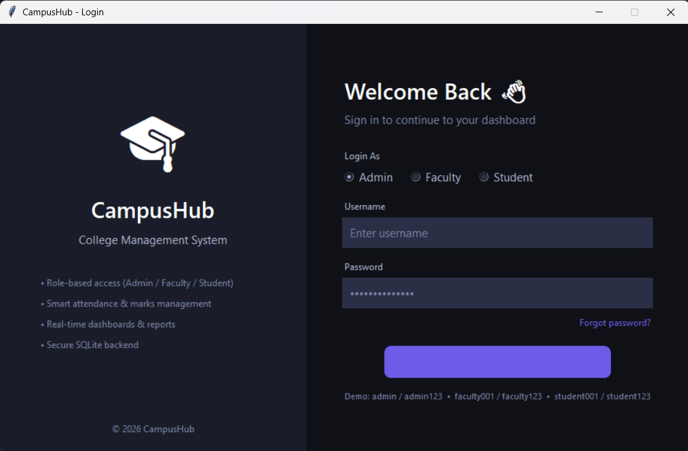

</div>

---

## ✨ Features

- 🔐 Role-Based Authentication (Admin / Faculty / Student)
- 📊 Real-Time Dashboard with Statistics & Charts
- 👥 Student Management (Add / Update / Delete / Search / Export CSV)
- 👩‍🏫 Faculty Management & Subject Assignment
- 📚 Course & Department Management
- 📅 Attendance Tracking (Daily / Monthly / Defaulter List)
- 📈 Automatic Grade, SGPA & CGPA Calculation
- 🧾 Marksheet Generation
- 💰 Fee Management with Receipt Generation
- 📖 Library System with Issue / Return & Fine Calculation
- 🗓 Timetable Scheduling (Dept / Semester / Faculty-wise)
- 📈 Consolidated Reports & Analytics
- ⚙️ Admin Console (User Mgmt, Password Reset, DB Backup)
- 💾 SQLite Database Integration
- 🎨 Modern Dark-Themed Tkinter GUI

---

## 🛠 Tech Stack

| Technology | Purpose |
|---|---|
| Python 3 | Core language |
| Tkinter | Desktop GUI framework |
| SQLite3 | Local database |
| csv | Data export |
| hashlib | Secure password hashing (SHA-256) |
| OOP | Modular class-based design |

---

## 📂 Project Structure

```
CampusHub/
│
├── main.py              # Application entry point + role-based shells
├── theme.py             # Shared dark theme & UI components
├── database.py          # SQLite schema & connection management
├── login.py             # Authentication screen
├── dashboard.py         # Dashboard with statistics & charts
├── students.py          # Student management module
├── faculty.py           # Faculty management module
├── courses.py           # Course & department management
├── attendance.py        # Attendance management module
├── marks.py             # Marks, grading & marksheet module
├── fees.py              # Fee management module
├── library.py           # Library management module
├── timetable.py         # Timetable management module
├── admin.py             # Reports & admin console
│
├── database/
│      campushub.db      # Auto-created SQLite database
│
├── assets/
│      logo.png          # App logo
│      screenshots/      # Application screenshots
│
└── README.md
```

---

## 📸 Screenshots

### 🔐 Login Page
Role-based authentication with secure password hashing (SHA-256). Choose Admin, Faculty, or Student login, or use the demo credentials to get started.


### 📊 Admin Dashboard
A real-time overview of the campus — total students, faculty, departments, attendance %, average CGPA, fee collection, and library books, plus a bar chart of students per department and a recent-activity feed.

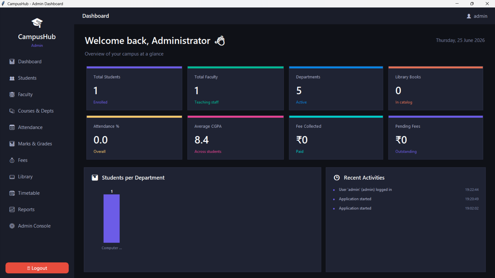

### 👥 Student Management
Full CRUD for students — add, update, delete, search, and export records to CSV. Auto-generates roll numbers and creates login accounts for new students.

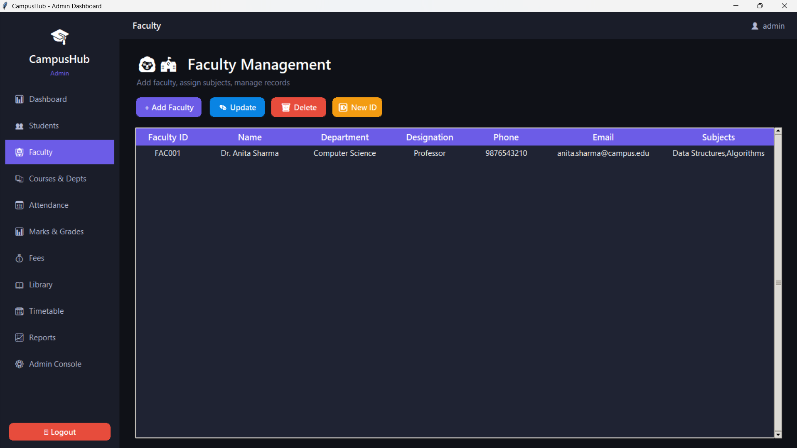

### ➕ Add / Edit Student
A clean form with input validation for adding or editing student details — department, semester, contact, CGPA, and more.

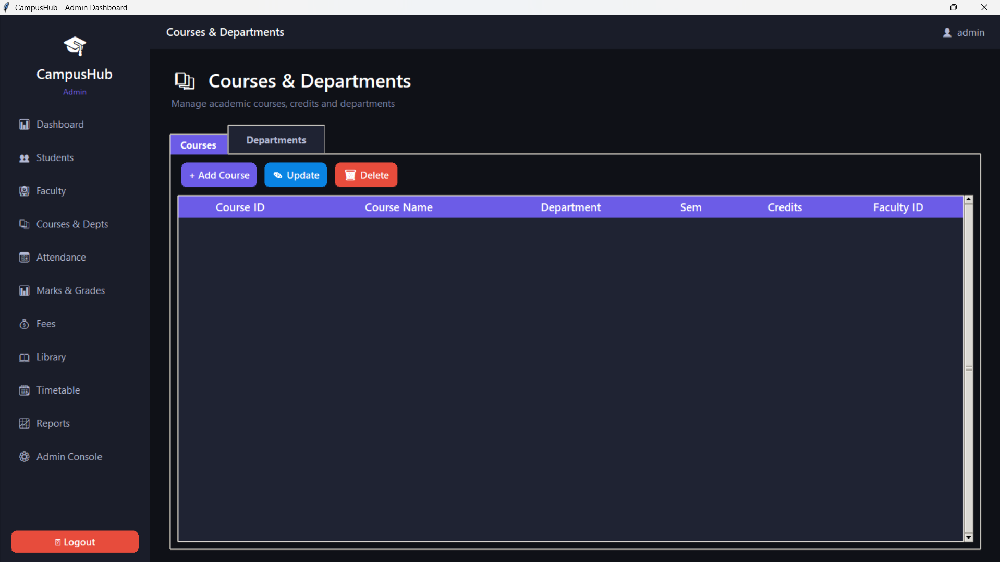

### 👩‍🏫 Faculty Management
Manage faculty records, assign subjects, and auto-generate faculty IDs. Each faculty member gets a dedicated login account.

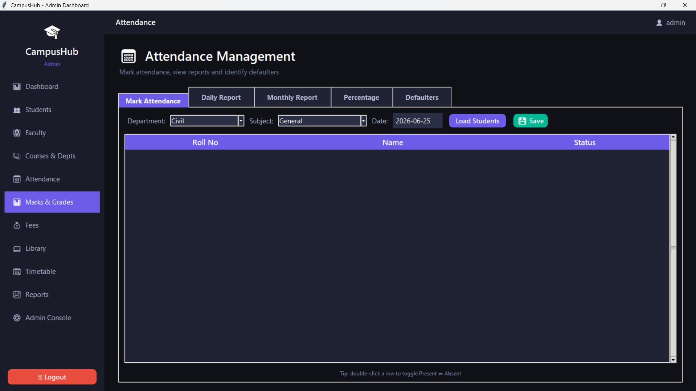

### 📚 Courses & Departments
Create and manage academic courses with credits, semester mapping, and faculty assignment. Manage departments and their heads.

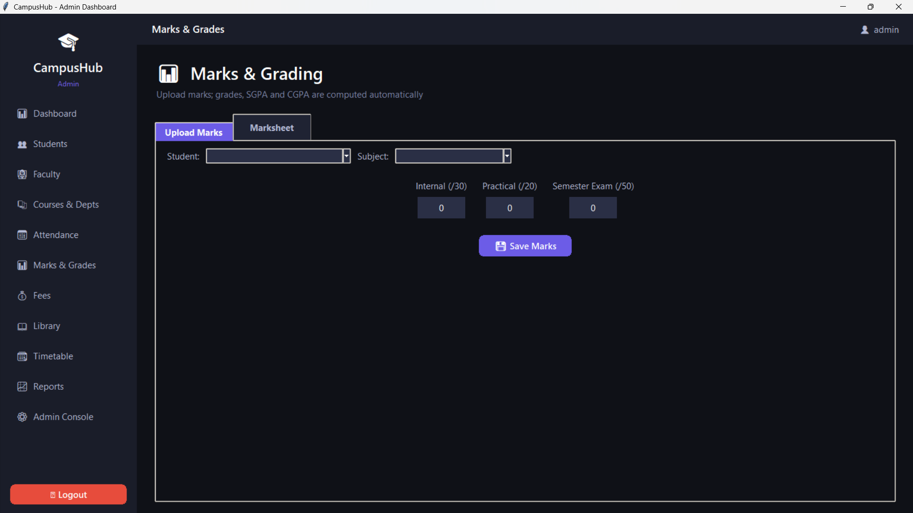

### 📅 Attendance Management
Mark attendance by department and subject, then view daily reports, monthly summaries, attendance percentages, and a defaulter list for students below the threshold.

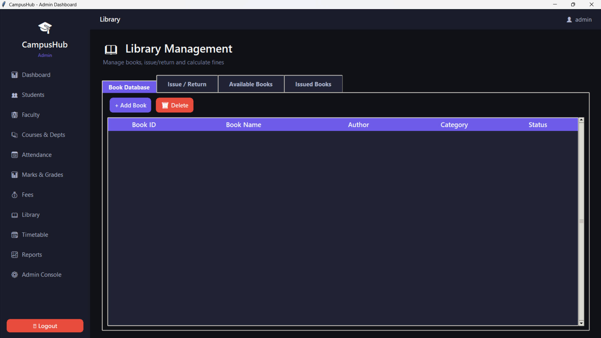

### 📈 Marks & Grading
Upload internal, practical, and semester marks. The system automatically computes the grade, percentage, SGPA, and CGPA with a live preview.

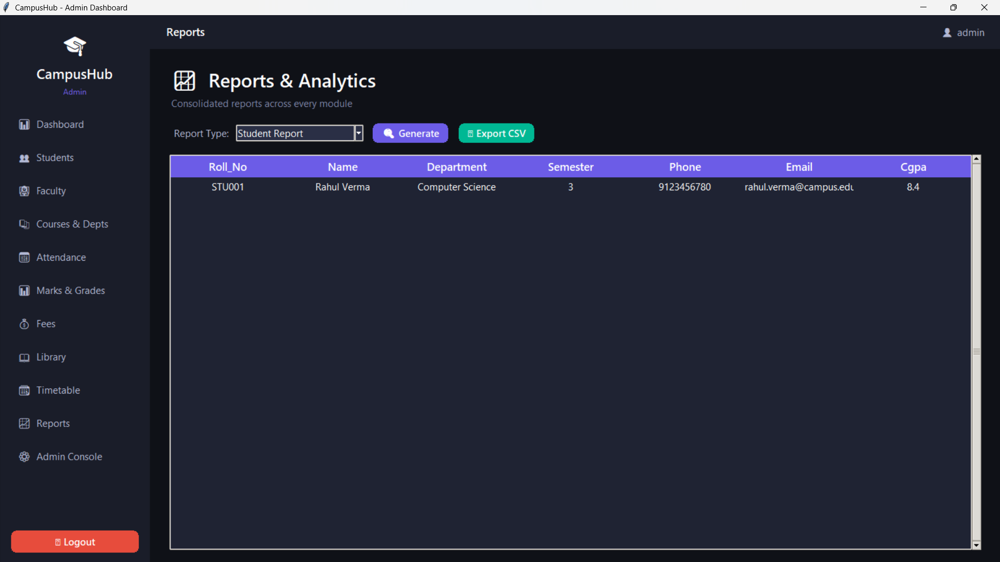

### 🧾 Marksheet Generation
Generate an official marksheet for any student showing subject-wise marks, percentages, grades, final CGPA, and PASS/FAIL result.

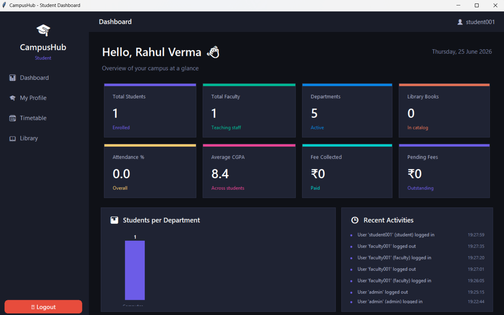

### 💰 Fee Management
Record fee payments, track pending fees, view payment history per student, and generate printable receipts with unique receipt numbers.

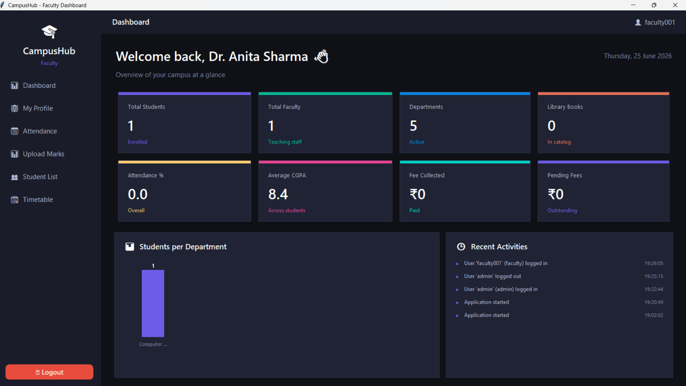

### 📖 Library Management
Maintain a book database, issue and return books with automatic due-date tracking and fine calculation (₹5/day beyond the 14-day loan window).

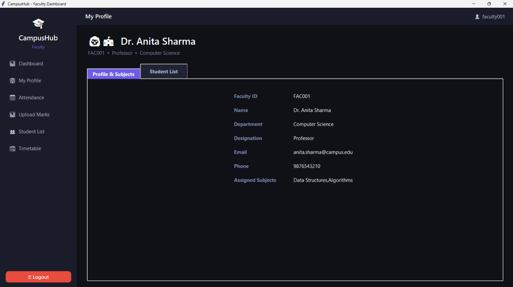

### 🗓 Timetable Management
Visual day × time-slot timetable grid. View by department, semester, or faculty, and add/remove slots with room allocation.

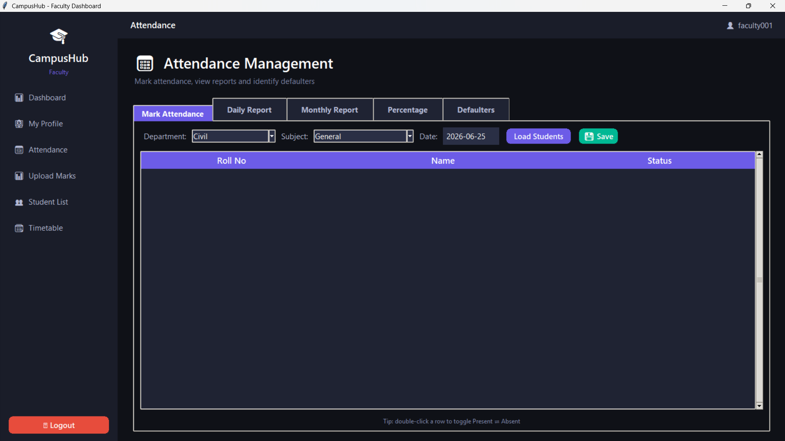

### 📈 Reports & Analytics
Consolidated reports across all modules — Student, Faculty, Attendance, Fee, Result, and Course reports — all exportable to CSV.

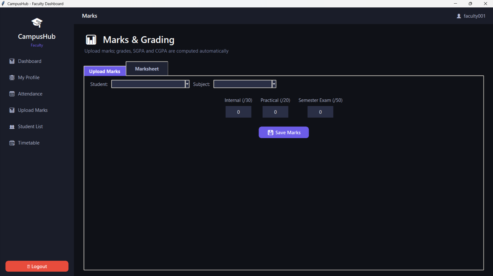

### ⚙️ Admin Console
System utilities — view the activity log, create user accounts, reset passwords, and back up the database to a safe location.

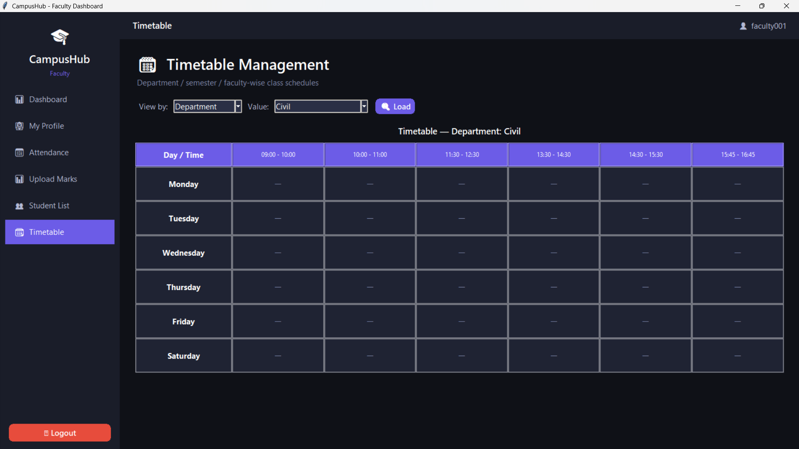

### 🎓 Student Profile
Students get a personal dashboard with tabs for their profile, attendance, marks & grades, and fee status.

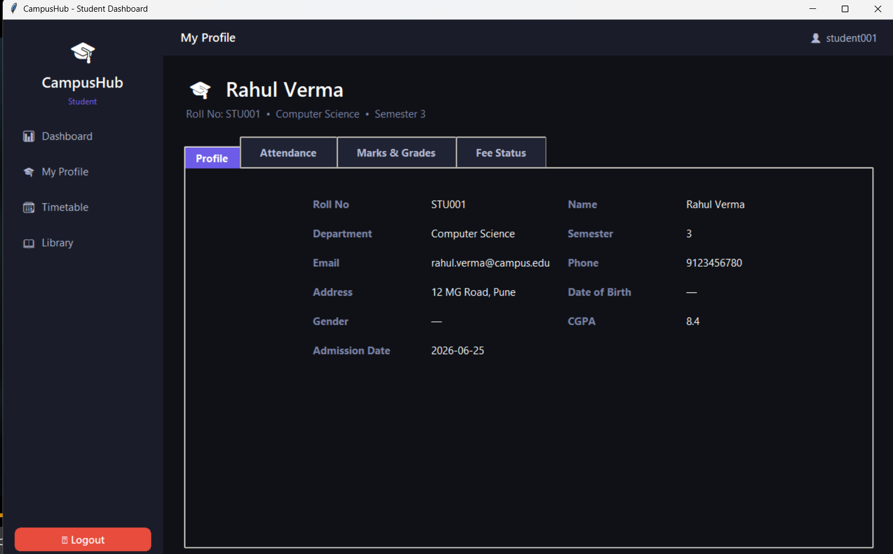

---

## ▶ Installation

### Prerequisites
- Python 3.10 or higher
- No external dependencies required (uses only the Python standard library)

### Setup

```bash
# Clone the repository
git clone https://github.com/yourusername/CampusHub.git
cd CampusHub

# Run the application
python main.py
```

The SQLite database (`database/campushub.db`) is created automatically on first run with seed data.

---

## 🔑 Default Login Credentials

| Role | Username | Password |
|---|---|---|
| Admin | `admin` | `admin123` |
| Faculty | `faculty001` | `faculty123` |
| Student | `student001` | `student123` |

---

## 🎯 Application Modules

### 👤 Admin Module
- Dashboard with Real-Time Statistics
- Student Management (Add / Update / Delete / Search / View All)
- Faculty Management & Subject Assignment
- Course & Department Management
- Fee Management
- Generate Student & Faculty IDs
- Reports & Data Export (CSV)
- Admin Console (Users, Backups, Password Reset)

### 🎓 Student Module
- Personal Profile (Info, Department, Semester)
- Attendance Records & Percentage
- Marks, Grades & CGPA
- Fee Status & History
- Timetable
- Library Books

### 👩‍🏫 Faculty Module
- Faculty Profile & Assigned Subjects
- Take Attendance
- Upload Marks
- View Student Lists
- Timetable

### 📅 Attendance Module
- Mark Attendance (Daily)
- Monthly Attendance Report
- Attendance Percentage
- Defaulter List (below threshold %)

### 📈 Marks Module
- Internal / Practical / Semester Marks
- Automatic Grade Calculation
- Automatic SGPA & CGPA
- Marksheet Generation

### 💰 Fee Module
- Fee Structure & Payment Entry
- Pending Fees Tracking
- Receipt Generation
- Payment History

### 📖 Library Module
- Book Database
- Issue / Return Books
- Fine Calculation (₹5/day overdue)
- Available & Issued Books Views

### 🗓 Timetable Module
- Department-wise Timetable
- Semester-wise Timetable
- Faculty-wise Timetable
- Room Allocation

---

## 🗄 Database Schema

| Table | Key Fields |
|---|---|
| **users** | id, username, password, role, ref_id |
| **departments** | id, name, hod, description |
| **students** | id, roll_no, name, department, semester, phone, email, address, cgpa |
| **faculty** | id, faculty_id, name, department, designation, phone, email, subjects |
| **courses** | course_id, course_name, department, semester, credits, faculty_id |
| **attendance** | id, student_id, subject, date, status |
| **marks** | id, student_id, subject, internal, practical, semester_exam, grade |
| **fees** | id, student_id, amount, payment_date, status, receipt_no |
| **library** | book_id, book_name, author, category, availability, issued_to, fine |
| **timetable** | id, department, semester, day, time_slot, subject, faculty_id, room |
| **activity_log** | id, activity, created_at |

---

## 📈 Grading Scale

Marks are combined (Internal /30 + Practical /20 + Semester /50 = /100) and graded automatically:

| Percentage | Grade | Points |
|---|---|---|
| ≥ 90 | O | 10 |
| ≥ 80 | A+ | 9 |
| ≥ 70 | A | 8 |
| ≥ 60 | B+ | 7 |
| ≥ 50 | B | 6 |
| ≥ 40 | C | 5 |
| < 40 | F | 0 |

---

## 🚀 Future Enhancements

- 📧 Email Notifications
- 📄 PDF Report Generation
- 🆔 QR Code Student ID Cards
- 📊 Barcode Library System
- 💾 One-Click Backup & Restore
- 🌙 Dark / Light Theme Toggle
- 🔐 Advanced Role-Based Permissions
- 🌐 REST API Integration
- 📱 Mobile Companion App

---

## 📚 Concepts Used

- Object-Oriented Programming (OOP)
- Functions & Modules
- SQLite Database & CRUD Operations
- Exception Handling
- File Handling (CSV Export, Receipts)
- GUI Development with Tkinter
- Database Connectivity
- Input Validation
- Secure Password Hashing (SHA-256)

---

## 👨‍💻 Author

**Mansi**

Computer Engineering Student

---

## ⭐ Support

If you like this project, don't forget to ⭐ star the repository!

---

## 📄 License

This project is open source and available for educational and portfolio use.
